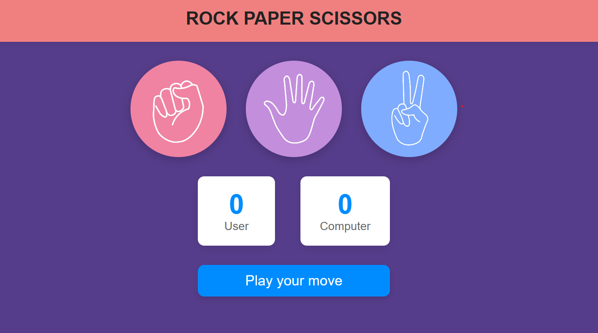

# 🪨 Rock Paper Scissors Game 🎮

A simple and responsive **Rock Paper Scissors** web game built with **HTML**, **CSS**, and **JavaScript**.

---

## 🚀 Features

- 🖼️ Clickable image cards for Stone, Paper, and Scissor
- 🤖 Computer makes a random move
- 🧠 Score tracking for user and computer
- 📱 Fully responsive design
- 🎨 Clean and modern UI

---

## 🛠️ Technologies Used

- HTML5
- CSS3 (Flexbox, Responsive Media Queries)
- JavaScript (DOM manipulation, logic)

---

## 📂 File Structure

rock-paper-scissors/
│
├── index.html # Main HTML file
├── rcp.css # Stylesheet
├── rcp1.js # JavaScript logic
├── stone.jpeg # Stone image
├── paper.jpeg # Paper image
└── scissor.jpeg # Scissor image

---

## 💡 How to Run

1. **Clone or download** this repository:

2. **Open `index.html`** in your browser.

---

## 🎯 How to Play

- Click on **Stone**, **Paper**, or **Scissor**
- The computer will auto-select a move
- The result and updated scores are displayed below

---

## 📸 Screenshots

## 

## 🙌 Credits

Built by Nikita Sain — A simple game to brush up JavaScript and styling skills.

---
